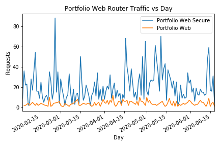

# Web Server Data Pipeline

Pure Python data pipeline for ingesting my webserver logs from my [portfolio website](https://niccannon.com/). The log file ingested is a JSON lines file produced by [Traefik](https://containo.us/traefik/), an example of a single log line can be found in `data/single_log.json`. The log file is appended to so the pipeline stores the amount of bytes read and continues reading from where it left off. I've tried to make the reading process as robust as possible. Ideally this pipeline should be run on a tight `CRON` schedule to minimize the amount of bytes being processed each ingestion.

## Installation

1. Clone the repo onto your server.
2. Set the environment variables `DB_URI` and `LOG_PATH` which correspond to the database uri that you want to ingest into and the path to the Traefik log file respectively.
3. Run the `provision_db.py` file to setup the database tables required for the pipeline.
4. Run the `pipeline.py` on a `CRON` schedule.

## Analyis

Had a lot of traffic from this spoofed host.

